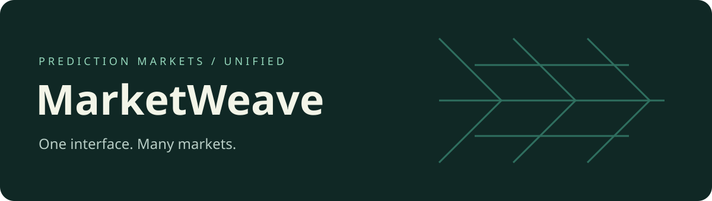

# MarketWeave

**Development history:** Developed locally before publication. These repositories were uploaded together, so their GitHub publication dates do not indicate when development began.



A common interface for prediction-market data, order books, execution estimates and supported venue operations. MarketWeave brings the TypeScript core, Python SDK and command-line tools into one source workspace.

## Start with the source

```sh
git clone https://github.com/nazeeh111/MarketWeave.git
cd MarketWeave
npm ci
npm run build --workspace=pmxt-core
npm run generate:sdk:typescript --workspace=pmxt-core
npm run build --workspace=pmxtjs
```

Package names (`pmxt-core`, `pmxtjs`, `pmxt`) and command names are retained as compatibility interfaces. No new registry packages are required for this source checkout. Existing response fields, calculations, transport routes and venue credentials retain their established meanings.

## Choose an entry point

| Goal | Start here |
| --- | --- |
| Understand the components | [Architecture](ARCHITECTURE.md) |
| Integrate Python or TypeScript | [Integration reference](docs/COMPATIBILITY_GUIDE.md) |
| Explore the core API | [API reference](core/API_REFERENCE.md) |
| Use the terminal | [CLI guide](sdks/cli/README.md) |
| Work on the code | [Contribution guide](CONTRIBUTING.md) |
| Inspect preservation checks | [Compatibility notes](COMPATIBILITY.md) |

## Data path

```text
Venue payloads → Exchange adapters → Unified models → SDK / local API / CLI
                                          ↓
                                Execution-price estimates
```

The core normalizes venue data; the SDKs expose that shared model. Hosting and venue access still depend on the configured services. Start with local examples and public data before supplying account credentials.

### Supported Exchanges

<p align="center">
  <a href="https://polymarket.com" style="color: inherit; text-decoration: none;"> <b>Polymarket</b></a>
  &nbsp;&nbsp;&nbsp;&nbsp;
  <a href="https://polymarket.us" style="color: inherit; text-decoration: none;"> <b>Polymarket US</b> 🇺🇸</a>
  &nbsp;&nbsp;&nbsp;&nbsp;
  <a href="https://kalshi.com" style="color: inherit; text-decoration: none;"> <b>Kalshi</b></a>
  &nbsp;&nbsp;&nbsp;&nbsp;
  <a href="https://limitless.exchange" style="color: inherit; text-decoration: none;"> <b>Limitless</b></a>
  &nbsp;&nbsp;&nbsp;&nbsp;
  <a href="https://probable.markets" style="color: inherit; text-decoration: none;"></a>
  &nbsp;&nbsp;&nbsp;&nbsp;
  <a href="https://baozi.bet" style="color: inherit; text-decoration: none;"> <b>Baozi</b></a>
  &nbsp;&nbsp;&nbsp;&nbsp;
  <a href="https://myriad.markets" style="color: inherit; text-decoration: none;"> <b>Myriad</b></a>
  &nbsp;&nbsp;&nbsp;&nbsp;
  <a href="https://opinion.trade" style="color: inherit; text-decoration: none;"> <b>Opinion</b></a>
  &nbsp;&nbsp;&nbsp;&nbsp;
  <a href="https://www.metaculus.com" style="color: inherit; text-decoration: none;"> <b>Metaculus</b></a>
  &nbsp;&nbsp;&nbsp;&nbsp;
  <a href="https://smarkets.com" style="color: inherit; text-decoration: none;"> <b>Smarkets</b></a>
  &nbsp;&nbsp;&nbsp;&nbsp;
  <a href="https://hyperliquid.xyz" style="color: inherit; text-decoration: none;"> <b>Hyperliquid</b></a>
  &nbsp;&nbsp;&nbsp;&nbsp;
  <a href="https://gemini.com" style="color: inherit; text-decoration: none;"> <b>Gemini Titan</b></a>
  &nbsp;&nbsp;&nbsp;&nbsp;
  <a href="https://www.suibets.com" style="color: inherit; text-decoration: none;"> <b>SuiBets</b></a>
  &nbsp;&nbsp;&nbsp;&nbsp;
  <a href="https://rain.one" style="color: inherit; text-decoration: none;"> <b>Rain</b></a>
  &nbsp;&nbsp;&nbsp;&nbsp;
  <a href="https://www.playhunch.xyz" style="color: inherit; text-decoration: none;"> <b>Hunch</b></a>
</p>

[Feature Support & Compliance](core/COMPLIANCE.md).


## Local verification

```sh
npm run build --workspace=pmxt-core
npm run generate:sdk:typescript --workspace=pmxt-core
npm run build --workspace=pmxtjs
npm test --workspace=pmxt-core -- --runInBand test/normalizers
```

The normalizer checks use recorded inputs. Live exchange and account tests are separate and require their own environment. Publication, tagging and cross-repository synchronization are manual; no inherited automation runs from this repository.

## Licensing

The existing [project license](LICENSE), [core license](core/LICENSE), and separate third-party notices remain in effect. Repository publication history is separate from source authorship.
